# mermint

Mint GitHub-ready Mermaid diagrams.

## Why mermint

- GitHub-faithful rendering: renders locally with Mermaid.js and applies GitHub-like defaults.
- Reliable hand-drawn style: normalizes `look: handDrawn` input and applies a consistent Rough.js pipeline across diagram types.
- Idempotent Markdown processing: re-running conversion does not destroy Mermaid sources.

## Install

Node 22+ is required.

One-off run from GitHub (no global install):

```bash
npx --yes git+https://github.com/alessandrobologna/mermint.git --help
```

Global install from GitHub (`pnpm`):

```bash
pnpm add -g --allow-build=mermint git+https://github.com/alessandrobologna/mermint.git
```

From this repository:

```bash
pnpm install
pnpm run build
pnpm link --global
```

If Playwright browsers are not installed yet:

```bash
npx playwright install
```

## Quickstart

Render one Mermaid file:

```bash
mermint --input path/to/diagram.mmd --output path/to/diagram.svg
```

Convert Markdown Mermaid blocks to `<picture>` + light/dark SVGs:

```bash
mermint \
  --input README.md \
  --svg-dir svgs \
  --keep-mermaid
```

## AWS Diagram

<div align="center">
<picture>
  <source media="(prefers-color-scheme: dark)" srcset="./svgs/readme-1-dark.svg">
  
</picture>
</div>

<details data-mermint-source="true">
  <summary>Mermaid source</summary>

```mermaid
---
config:
  look: handDrawn
  x-mermint:
    rough:
      hachureGap: 1
  architecture:
    iconPacks:
      aws: https://unpkg.com/@iconify-json/logos@1/icons.json
---
architecture-beta
  group api(aws:aws-api-gateway)[API Layer]
  service apigw(aws:aws-api-gateway)[API Gateway] in api

  group compute(aws:aws-lambda)[Compute]
  service lambda(aws:aws-lambda)[Lambda] in compute
  junction fanout in compute

  group messaging(aws:aws-sqs)[Messaging]
  service sqs(aws:aws-sqs)[SQS] in messaging

  group data(aws:aws-dynamodb)[Data]
  service ddb(aws:aws-dynamodb)[DynamoDB] in data
  service s3(aws:aws-s3)[S3] in data
  junction datahub in data

  apigw:R --> L:lambda
  lambda:R -- L:fanout
  fanout:B --> T:sqs
  fanout:R --> L:datahub
  datahub:T --> B:ddb
  datahub:B --> T:s3
```

</details>

## Usage

```bash
mermint --help
```

Command synopsis:

`mermint --input <file> [--output <file>] [options]`

Most used options:

| Option | Purpose |
| --- | --- |
| `--mode <diagram\|markdown>` | Override mode detection from `--input` extension. |
| `--look <classic\|handDrawn>` | Force style for this run. |
| `--theme <name>` | Set Mermaid theme (diagram mode, and dark render in markdown mode). |
| `--light-theme <name>` | Light render theme in markdown mode. |
| `--svg-dir <dir>` | Choose output directory for markdown-generated SVGs. |
| `--keep-mermaid` | Keep original Mermaid source in a `<details>` block. |
| `--icon-pack <spec>` | Load icon packs for architecture/icon syntax. Repeatable. |
| `--roughness <value>` | Tune hand-drawn intensity (default: `0.5` when hand-drawn is active). |
| `--no-transparent-bg` | Keep a visible background instead of transparent output. |

## Diagram Showcase

### Flowchart

<div align="center">
<picture>
  <source media="(prefers-color-scheme: dark)" srcset="./svgs/readme-2-dark.svg">
  
</picture>
</div>

<details data-mermint-source="true">
  <summary>Mermaid source</summary>

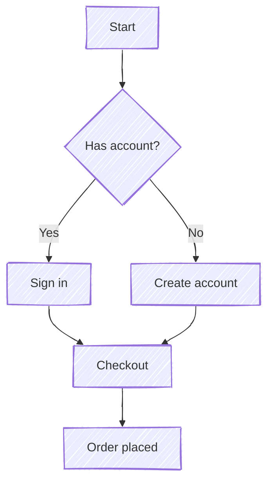

</details>

### Sequence

<div align="center">
<picture>
  <source media="(prefers-color-scheme: dark)" srcset="./svgs/readme-3-dark.svg">
  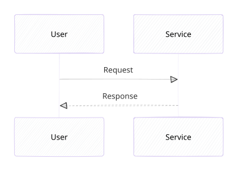
</picture>
</div>

<details data-mermint-source="true">
  <summary>Mermaid source</summary>

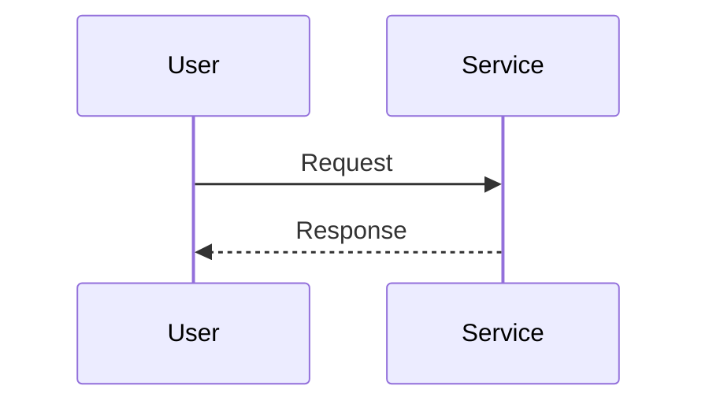

</details>

### Class

<div align="center">
<picture>
  <source media="(prefers-color-scheme: dark)" srcset="./svgs/readme-4-dark.svg">
  
</picture>
</div>

<details data-mermint-source="true">
  <summary>Mermaid source</summary>

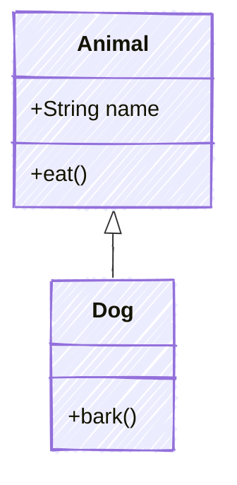

</details>

### Block

<div align="center">
<picture>
  <source media="(prefers-color-scheme: dark)" srcset="./svgs/readme-5-dark.svg">
  
</picture>
</div>

<details data-mermint-source="true">
  <summary>Mermaid source</summary>

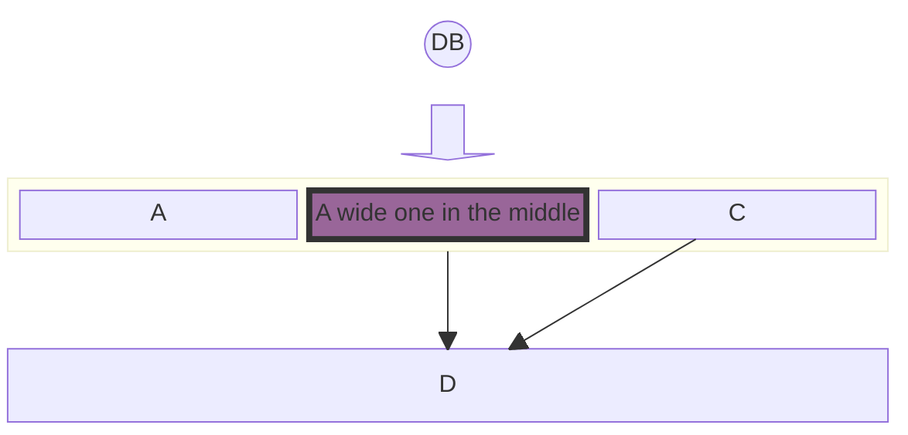

</details>

### Git

<div align="center">
<picture>
  <source media="(prefers-color-scheme: dark)" srcset="./svgs/readme-6-dark.svg">
  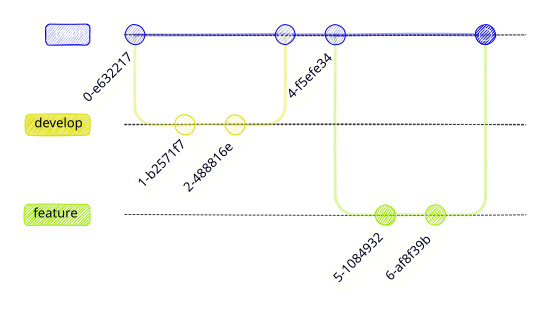
</picture>
</div>

<details data-mermint-source="true">
  <summary>Mermaid source</summary>

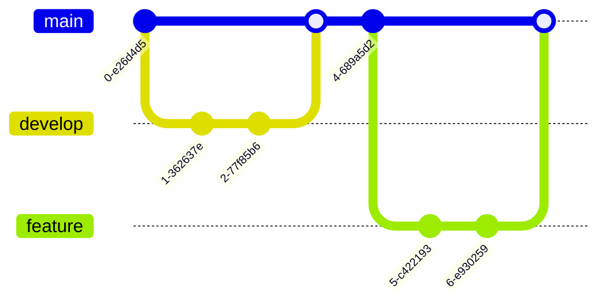

</details>

### Kanban

<div align="center">
<picture>
  <source media="(prefers-color-scheme: dark)" srcset="./svgs/readme-7-dark.svg">
  
</picture>
</div>

<details data-mermint-source="true">
  <summary>Mermaid source</summary>

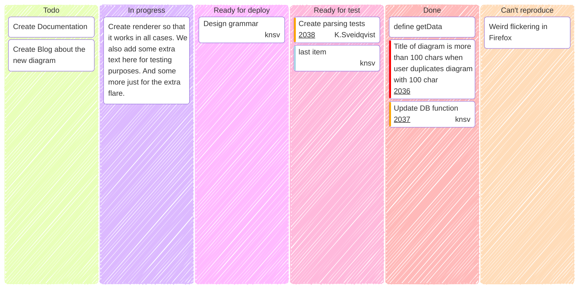

</details>

Example source attribution: Mermaid Live Editor examples from [`mermaid-js/mermaid-live-editor`](https://github.com/mermaid-js/mermaid-live-editor).

## Option Reference

### General

| Option | Default | Description |
| --- | --- | --- |
| `--input <file>` | required | Input file (Mermaid or Markdown). |
| `--output <file>` | unset | Output path (`.svg` in diagram mode, Markdown path in markdown mode). |
| `--mode <diagram\|markdown>` | inferred from `--input` extension | Override mode detection. |
| `--theme <name>` | diagram: `default` / markdown dark: `dark` | Mermaid theme. |
| `--look <classic\|handDrawn>` | unset | Override Mermaid look. |
| `--icon-pack <spec>` | unset | Register icon pack (`name=path-or-url` or `path-or-url`). Repeatable. |

### Markdown Mode

| Option | Default | Description |
| --- | --- | --- |
| `--svg-dir <dir>` | `svgs` | Directory for rendered SVGs. |
| `--light-theme <name>` | `default` | Mermaid theme for light SVGs. |
| `--keep-mermaid` | on for in-place conversions | Keep Mermaid source in a `<details>` block. |
| `--base-url <url>` | `https://mermaid.live` | Base URL used for Mermaid edit links. |

### Hand-Drawn / Rough.js

| Option | Default | Description |
| --- | --- | --- |
| `--roughness <value>` | `0.5` when hand-drawn active | Rough.js roughness. |
| `--fill-weight <value>` | unset | Rough.js fill weight for hatching. |
| `--fill-style <value>` | unset | `hachure`, `solid`, `zigzag`, `cross-hatch`, `dots`, `dashed`, `zigzag-line`. |
| `--hachure-gap <value>` | unset | Rough.js hachure gap override. |
| `--hachure-angle <value>` | unset | Rough.js hachure angle override. |
| `--bowing <value>` | unset | Rough.js bowing amount override. |
| `--stroke-width <value>` | unset | Rough.js stroke width override. |
| `--seed <value>` | unset | Rough.js deterministic seed (strict integer). |
| `--multi-stroke` / `--no-multi-stroke` | unset | Enable/disable Rough.js multi-stroke. |
| `--multi-stroke-fill` / `--no-multi-stroke-fill` | unset | Enable/disable Rough.js multi-stroke fill. |
| `--preserve-vertices` / `--no-preserve-vertices` | unset | Enable/disable Rough.js vertex preservation. |

### Fonts

| Option | Default | Description |
| --- | --- | --- |
| `--use-excalifont` | off | Use Excalifont without hand-drawn look. |
| `--font-family <list>` | unset | Override font-family list. |
| `--font-size <px>` | `13` | Label font size (strict integer). |
| `--embed-font <path>` | unset | Embed a custom font file into SVG. |
| `--embed-font-family <name>` | unset | Font-family name for `--embed-font`. |
| `--no-embed-excalifont` | active when Excalifont active | Disable bundled Excalifont embedding. Errors if Excalifont is not active. |

### Rendering and Runtime

| Option | Default | Description |
| --- | --- | --- |
| `--no-transparent-bg` | off | Keep non-transparent background in output. |
| `--settle-ms <ms>` | `1500` | Extra wait after render (strict integer). |
| `--timeout-ms <ms>` | `60000` | Playwright timeout in ms (strict integer). |
| `--headed` | off | Run browser in headed mode. |
| `-y, --yes` | off | Skip confirmation prompts for in-place markdown overwrite. |
| `--quiet` | off | Suppress output. |
| `--no-spinner` | off | Disable spinner output. |
| `--verbose` | off | Show extra details. |

## Notes

- If `--look` is unset, the tool respects `look` from frontmatter/init.
- Mode inference: diagram (`.mmd`, `.mermaid`), markdown (`.md`, `.markdown`, `.mdx`). Use `--mode` for non-standard extensions.
- In diagram mode, `--output` is required. In markdown mode, omitting `--output` updates the input file in place.
- In-place markdown updates ask for confirmation before overwrite. Use `--yes` to bypass the prompt.
- In hand-drawn mode, Mermaid `look: handDrawn` is normalized to classic before render, then the tool applies a consistent Rough.js pipeline.
- Rough overrides can be set in source via `x-mermint.rough` (frontmatter/init) with precedence `CLI > source > defaults`.
- `--look classic` disables hand-drawn rendering and is incompatible with rough overrides.
- Icon packs can be configured via `--icon-pack` or source config (`architecture.iconPacks`); CLI values win on name conflicts.
- Numeric parsing is strict: integer-only flags reject suffixes; rough scalar flags require numeric values.

## License

Project license: `MIT` (see `LICENSE`).

Font note: the example SVGs may embed Excalifont. The OFL-1.1 text is included at `LICENSES/Excalifont-OFL-1.1.txt` and the bundled font file is `assets/fonts/Excalifont-Regular.woff2`.
