# @mermint/aws-iconify-json

Build [IconifyJSON](https://iconify.design/docs/types/iconify-json.html) packs from AWS Architecture Service SVG icon bundles.

## Quick start

```bash
# 1. Download the AWS icon zip from https://aws.amazon.com/architecture/icons/

# 2. Build the icon pack.
cd packages/aws-iconify-json
pnpm install && pnpm build
pnpm exec ./dist/cli.js --source /tmp/aws-icons.zip --output /tmp/aws-icons.json

# 3. Use /tmp/aws-icons.json as an Iconify icon pack in Mermaid or any Iconify consumer.
```

## Install the CLI globally

From the monorepo root:

```bash
pnpm add -g ./packages/aws-iconify-json
mermint-build-aws-icons --help
```

## Get source SVGs from AWS

1. Go to the [AWS Architecture Icons](https://aws.amazon.com/architecture/icons/) page.
2. Download the current "Asset Package" zip file.
3. Save it as `/tmp/aws-icons.zip` (or any path you prefer).

## Build Iconify JSON (from source checkout)

```bash
cd packages/aws-iconify-json
pnpm install
pnpm build
pnpm exec ./dist/cli.js \
  --source /tmp/aws-icons.zip \
  --output /tmp/aws-architecture-service-icons.json \
  --icons-list /tmp/ICONS.md \
  --icons-svg-dir /tmp/icons \
  --size 48 \
  --prefix aws-arch
```

The output is an [IconifyJSON](https://iconify.design/docs/types/iconify-json.html) file containing one entry per AWS service icon.

## CLI flags

| Flag | Required | Default | Description |
|------|----------|---------|-------------|
| `--source <path>` | yes | | Source directory or AWS icon zip archive |
| `--output <path>` | no | `assets/icon-packs/aws-architecture-service-icons.json` | Output IconifyJSON file path |
| `--size <number>` | no | `48` | SVG size variant to extract (`16`, `32`, `48`, `64`) |
| `--prefix <value>` | no | `aws-arch` | Iconify prefix (shorter values reduce diagram verbosity) |
| `--icons-list <path>` | no | | Write a markdown icon table (`Preview \| Name \| Aliases`) |
| `--icons-svg-dir <path>` | no | `svgs/icons` | Directory for per-icon SVG previews used by `--icons-list` |
| `--compact` | no | | Write compact (minified) JSON |

`--source` accepts:
- A zip archive downloaded from AWS.
- A direct `Architecture-Service-Icons_*` directory.
- A parent directory containing one `Architecture-Service-Icons_*` folder.
- Fallback: if no such directory exists, it scans recursively for `Arch_*_<size>.svg`.

## Usage with Mermaid

Generate a local icon pack file for Mermaid:

```bash
cd packages/aws-iconify-json
pnpm exec ./dist/cli.js \
  --source /tmp/aws-icons.zip \
  --output ./aws-architecture-service-icons.json \
  --size 48 \
  --prefix aws
```

Then use it in Mermaid init/frontmatter:

<div align="center">
<picture>
  <source media="(prefers-color-scheme: dark)" srcset="./svgs/readme-1-dark.svg">
  
</picture>
</div>

<details data-mermint-source="true">
  <summary>Mermaid source</summary>



</details>

```mermaid
---
config:
  look: handDrawn
  x-mermint:
    rough:
      hachureGap: 1
  architecture:
    iconPacks:
      aws: ./aws-architecture-service-icons.json
---
architecture-beta
  group ingest(aws:amazon-kinesis)[Ingestion]
  service kinesis(aws:amazon-kinesis)[Kinesis] in ingest
  service firehose(aws:amazon-data-firehose)[Firehose] in ingest

  group store(aws:amazon-simple-storage-service)[Storage]
  service s3(aws:amazon-simple-storage-service)[S3 Data Lake] in store

  group transform(aws:aws-glue)[Transform]
  service glue(aws:aws-glue)[Glue ETL] in transform
  service athena(aws:amazon-athena)[Athena] in transform

  group warehouse(aws:amazon-redshift)[Analytics]
  service redshift(aws:amazon-redshift)[Redshift] in warehouse
  service grafana(aws:amazon-managed-grafana)[Grafana] in warehouse

  kinesis:R --> L:firehose
  firehose:B --> T:s3
  s3:R --> L:glue
  glue:R --> L:athena
  athena:B --> T:redshift
  redshift:R --> L:grafana
```

## Naming and size logic

The tool only reads files matching:
- `Arch_<service>_<size>.svg`

Example:
- `Arch_Amazon-Bedrock-AgentCore_48.svg`

Icon name mapping:
- take `<service>`
- lowercase it
- replace non-alphanumeric runs with `-`
- collapse repeated `-`
- trim leading/trailing `-`

So:
- `Amazon-Bedrock-AgentCore` -> `amazon-bedrock-agentcore`

Why `--size` exists for SVG:
- AWS ships separate SVG variants (`16/32/48/64`), and they are often not identical.
- Small sizes are usually simplified/optimized for legibility.
- The generator picks one size (default `48`) to produce one stable icon per service key.

Duplicate handling:
- same normalized name + identical SVG data: keep one, drop duplicates
- same normalized name + different SVG data: keep both, suffix one with category (for example `...-management-tools`)

## License

MIT
