# Mermint Markdown Workflow

Use this workflow to render Markdown Mermaid blocks into GitHub-friendly `<picture>` markup and SVG assets.
Prefer running `mermint` directly from this GitHub repo with `npx`; do not assume a local checkout or global install.
For hand-drawn or `architecture-beta` work, do not stop at a successful SVG render. Rasterize previews, inspect them visually, and iterate until readability and aesthetics are acceptable in both themes.

## Inputs To Confirm

- Target markdown file (example: `README.md`)
- SVG output directory (example: `svgs`)
- In-place overwrite vs separate output path
- Whether Mermaid source must be preserved (`--keep-mermaid`)
- Whether hand-drawn tuning is allowed, or whether the user wants the existing style preserved

## Preflight Checks

Before rendering, check:

- `node` is installed and version `>= 22`
- `npx` is available
- network access is available, because the CLI is fetched from GitHub

Example:

```bash
node --version
npx --version
```

## Standard Commands

Primary command:

```bash
npx --yes git+https://github.com/alessandrobologna/mermint.git \
  --input README.md \
  --svg-dir svgs \
  --keep-mermaid
```

Use explicit themes when you want stable readme-style output:

```bash
npx --yes git+https://github.com/alessandrobologna/mermint.git \
  --input README.md \
  --svg-dir svgs \
  --light-theme default \
  --theme dark \
  --keep-mermaid
```

For non-interactive in-place conversion (CI/automation), add `--yes`:

```bash
npx --yes git+https://github.com/alessandrobologna/mermint.git \
  --input README.md \
  --svg-dir svgs \
  --keep-mermaid \
  --yes
```

For a non-destructive preview, write to a separate markdown output:

```bash
npx --yes git+https://github.com/alessandrobologna/mermint.git \
  --input README.md \
  --output /tmp/README.rendered.md \
  --svg-dir /tmp/mermint-svgs \
  --keep-mermaid
```

## Raster Preview Commands

After SVG rendering, rasterize both light and dark outputs to PNG previews before judging quality.
Prefer representative backgrounds:

- light preview background: `#ffffff`
- dark preview background: `#0d1117`

Preferred command with `rsvg-convert`:

```bash
mkdir -p /tmp/mermint-previews

for svg in svgs/*-light.svg; do
  png="/tmp/mermint-previews/$(basename "${svg%.svg}.png")"
  rsvg-convert --background-color '#ffffff' "$svg" -o "$png"
done

for svg in svgs/*-dark.svg; do
  png="/tmp/mermint-previews/$(basename "${svg%.svg}.png")"
  rsvg-convert --background-color '#0d1117' "$svg" -o "$png"
done
```

Fallback with ImageMagick:

```bash
mkdir -p /tmp/mermint-previews

for svg in svgs/*-light.svg; do
  png="/tmp/mermint-previews/$(basename "${svg%.svg}.png")"
  magick -background '#ffffff' "$svg" -flatten "$png"
done

for svg in svgs/*-dark.svg; do
  png="/tmp/mermint-previews/$(basename "${svg%.svg}.png")"
  magick -background '#0d1117' "$svg" -flatten "$png"
done
```

If neither rasterizer is available, open the SVGs in a browser and capture screenshots of both the light and dark variants before approving the result.

## Frontmatter / Init Conventions

This workflow supports source-level Mermaid config in frontmatter/init, including:

- `config.look`
- `config.fontFamily`
- `config.architecture.iconPacks`
- `x-mermint.rough`

`mermint` includes a built-in `aws` icon pack for Mermaid architecture diagrams. Use `aws:<icon>` directly without adding a URL or local icon-pack path.

When generating or revising AWS architecture diagrams, read [references/aws-architecture-icons.md](references/aws-architecture-icons.md) before inventing icon names.
Prefer concrete AWS service icons over generic Mermaid shapes when the service is known.
Examples:

- use `aws:simple-storage-service` for S3-style storage instead of `disk`
- use `aws:dynamodb` for DynamoDB-style state instead of `database`
- use `aws:simple-queue-service` for SQS instead of a generic queue/storage symbol
- use `aws:amazon-simple-notification-service` or `aws:simple-notification-service` for SNS
- fall back to generic Mermaid shapes only when there is no suitable AWS service icon

Use `config.architecture.iconPacks` only when you need:

- additional non-AWS icon packs
- a local override for the built-in `aws` pack
- a pinned custom AWS pack snapshot

## Optional Hand-Drawn Tuning

Enable hand-drawn rendering with either:

- `config.look: handDrawn` in frontmatter/init
- `--look handDrawn` on the CLI

Tune the Rough.js pass with `x-mermint.rough` in source config, or with CLI flags when you want a one-off override.

Supported rough keys:

- `roughness`
- `fillWeight`
- `fillStyle`
- `hachureGap`
- `hachureAngle`
- `bowing`
- `strokeWidth`
- `seed`
- `disableMultiStroke`
- `disableMultiStrokeFill`
- `preserveVertices`

Important behavior:

- rough precedence is `CLI > source config > defaults`
- `--look classic` is incompatible with rough overrides
- built-in `aws` icons work normally in hand-drawn mode
- hand-drawn `architecture-beta` diagrams with icon references default to `fillStyle: solid` for icon legibility unless you explicitly set a fill style

Example with AWS icons and source-level Rough.js tuning:

```mermaid
---
config:
  look: handDrawn
x-mermint:
  rough:
    roughness: 0.55
    fillStyle: cross-hatch
    hachureGap: 1
    bowing: 0.8
    seed: 42
---
architecture-beta
  group api(aws:aws-api-gateway)[API Layer]
  service gateway(aws:aws-api-gateway)[API Gateway] in api
  group compute(aws:aws-lambda)[Compute]
  service fn(aws:aws-lambda)[Lambda] in compute
  gateway:R --> L:fn
```



Equivalent CLI shape for a one-off render:

```bash
npx --yes git+https://github.com/alessandrobologna/mermint.git \
  --input README.md \
  --svg-dir svgs \
  --keep-mermaid \
  --look handDrawn \
  --roughness 0.55 \
  --fill-style cross-hatch \
  --hachure-gap 1 \
  --bowing 0.8 \
  --seed 42
```

## AWS Architecture Example

Built-in AWS icons with no extra pack config:

Legibility note:

- if you use hand-drawn mode with architecture icons and do not specify `fillStyle`, `mermint` now defaults those diagrams to `fillStyle: solid`
- set `x-mermint.rough.fillStyle` or `--fill-style` explicitly if you want hachure, cross-hatch, or another Rough.js fill style instead

```mermaid
---
config:
  look: handDrawn
---
architecture-beta
  group api(aws:aws-api-gateway)[API Layer]
  service gateway(aws:aws-api-gateway)[API Gateway] in api

  group compute(aws:aws-lambda)[Compute]
  service lambda(aws:aws-lambda)[Lambda] in compute

  group messaging(aws:simple-queue-service)[Messaging]
  service queue(aws:simple-queue-service)[SQS] in messaging

  gateway:R --> L:lambda
  lambda:B --> T:queue
```



Override the built-in `aws` pack only when needed:

```mermaid
---
config:
  architecture:
    iconPacks:
      aws: ./aws-architecture-service-icons.json
---
architecture-beta
  service queue(aws:simple-queue-service)[SQS]
```



If icon packs use relative paths, they resolve from:

- diagram mode: directory of the input `.mmd` file
- markdown mode: directory of the markdown file

## `architecture-beta` Guardrails

`architecture-beta` is less predictable than simpler Mermaid diagram types. A render can succeed and still produce an unusable layout.

Prefer these constraints when creating or revising architecture diagrams:

- keep labels short and conservative
- avoid slash-heavy or punctuation-heavy labels unless you render-test them
- avoid decorative edge labels unless they carry essential meaning
- use `junction` for optional branches or fan-out instead of forcing extra direct edges between services

Recommended optional-branch pattern:

```mermaid
architecture-beta
  service relay(aws:kinesis-data-streams)[Relay]
  junction fanout
  service collector(aws:amazon-opensearch-service)[Collector]
  service archive(aws:simple-storage-service)[Archive]

  relay:R --> L:fanout
  fanout:T --> B:collector
  fanout:B --> T:archive
```



Fallback rule:

- if `architecture-beta` still overlaps after one conservative rewrite, stop and either simplify further with a junction-based branch or ask whether to switch to `flowchart` while preserving the architecture meaning

## Visual Inspection Workflow

For `architecture-beta` and hand-drawn output, use an image-capable model or visual inspection pass on rasterized PNG previews.
Do not rely only on Mermaid parse success or SVG existence.

Inspect both:

- the light-theme PNG on a light background
- the dark-theme PNG on a dark background

When an image-capable model is available, provide both PNGs and ask it to evaluate:

- readability at normal README viewing size
- overlap, clipping, and cramped layout
- contrast and legibility in both themes
- icon clarity and whether hatching interferes with service recognition
- whether the hand-drawn treatment feels intentional rather than noisy

If no visual model is available, do the same checklist manually in an image viewer or browser.

## Quality Rubric

Treat the result as acceptable only when all of the following pass:

- Layout: nodes, labels, icons, and edge labels do not overlap or clip.
- Readability: labels are readable without zooming excessively and line crossings do not obscure meaning.
- Theme contrast: the light variant reads cleanly on `#ffffff`, and the dark variant reads cleanly on `#0d1117`.
- Icon clarity: AWS or other service icons remain recognizable and are not muddied by hatching or stroke noise.
- Hand-drawn balance: the diagram feels organic, but not shaky, fuzzy, or visually exhausting.
- Fill control: fills and hatching add texture without overpowering text, icons, or edge direction.
- Visual consistency: light and dark variants feel like the same diagram, not two different layouts or densities.

Use a simple decision per preview:

- `pass`: no change needed
- `adjust`: structurally correct, but visual tuning is still needed
- `fail`: layout or readability is not acceptable

## Iterative Tuning Loop

When visual inspection finds problems:

1. Change only one or two rough parameters at a time.
2. Re-render the SVGs.
3. Re-rasterize both light and dark previews.
4. Re-run the visual inspection on both themes.
5. Stop once the rubric passes, or simplify the diagram structure if tuning alone is no longer helping.

Prefer two or three small iterations over one large uncontrolled change.

Symptom-driven parameter guide:

- Too noisy or shaky:
  - lower `roughness`
  - lower `bowing`
  - consider `disableMultiStroke: true`
  - consider `preserveVertices: true`
- Hatching is too dense or text/icons feel muddy:
  - increase `hachureGap`
  - lower `fillWeight`
  - consider `fillStyle: solid` for icon-heavy architecture diagrams
- Diagram feels too sterile or over-clean:
  - increase `roughness` slightly
  - increase `bowing` slightly
  - decrease `hachureGap` slightly if fill texture is too sparse
- Same structure, but a particular seed looks awkward:
  - keep the geometry the same and change `seed`
- Strokes or fill lines are too faint:
  - increase `strokeWidth`
  - increase `fillWeight`
- Fine geometry is being distorted too much:
  - lower `roughness`
  - lower `bowing`
  - enable `preserveVertices`

Practical defaults for iterative experiments:

- adjust `roughness` in small steps such as `0.05`
- adjust `fillWeight` in small steps such as `0.1`
- adjust `hachureGap` in small steps such as `0.5`
- adjust `bowing` in small steps such as `0.1`
- keep `seed` fixed while tuning other parameters, then vary `seed` only after the style is close

## Verification Checklist

After rendering:

1. Confirm markdown contains `<picture>` blocks:
```bash
rg -n "<picture>" README.md
```
2. If `--keep-mermaid` is expected, confirm preserved source blocks:
```bash
rg -n "data-mermint-source=\"true\"" README.md
```
3. Confirm SVG assets exist and are non-empty:
```bash
ls -la svgs
```
4. Rasterize both `*-light.svg` and `*-dark.svg` outputs to PNG previews on representative backgrounds.
5. Inspect both PNGs with an image-capable model or a manual visual pass.
6. Apply the quality rubric.
7. If the result is only `adjust`, iterate with small rough-parameter changes and re-check both themes.
8. For `architecture-beta`, do not accept the output just because it rendered successfully.
   Labels still need to be readable, icons need to stay legible, and the final layout must be usable in both themes.

## Failure Recovery

- If `node --version` is lower than `22`, upgrade Node before running `mermint`.
- If `npx` is unavailable, install a recent Node.js distribution that includes npm/npx.
- If Playwright browsers are missing:
```bash
npx playwright install
```
- If the error says `Executable doesn't exist at .../chromium_headless_shell-<rev>/...`, a generic `npx playwright install` may have installed the wrong browser revision for the Playwright version that `mermint` resolved.
- In a local checkout, install the headless shell with the exact Playwright version from `node_modules` instead of relying on an unpinned CLI:
```bash
PLAYWRIGHT_VERSION=$(node -p "require('./node_modules/playwright/package.json').version")
npx --yes playwright@$PLAYWRIGHT_VERSION install chromium-headless-shell
```
- If you are running `mermint` via `npx --yes git+https://github.com/alessandrobologna/mermint.git ...` and still hit the same `chromium_headless_shell-<rev>` error, do not keep retrying an unpinned `npx playwright install`. Re-run with a version-pinned Playwright CLI or switch to a local checkout long enough to discover the resolved version first.
- If verification uses `rg` and it is unavailable, use `grep` instead.
- If PNG preview generation is needed and `rsvg-convert` is unavailable, try `magick`.
- If both rasterizers are unavailable, open the SVG in a browser and capture screenshots instead of skipping visual review.
- If rendering fails due to invalid source rough config, fix `x-mermint.rough` values in source or remove conflicting `--look classic`.
- If repeated rough tuning still produces a crowded or unreadable `architecture-beta` layout, simplify labels and edges or switch to a less layout-fragile Mermaid diagram type.
